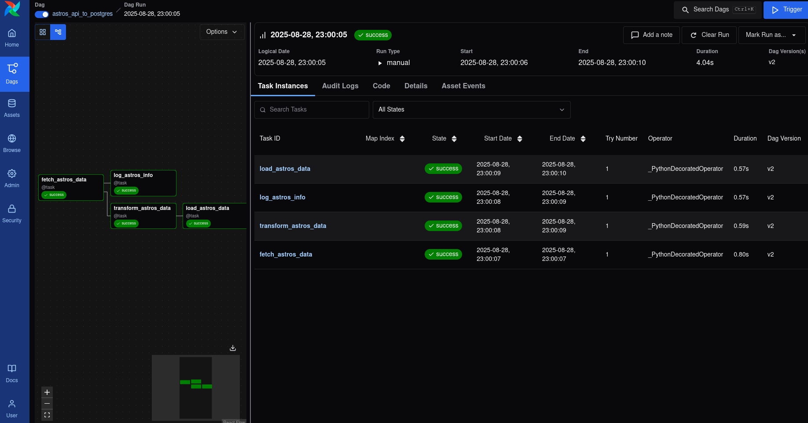

# IDFTestProject

# Pipeline Architecture


Basicaly we are loading data from Astros API. After that we are loading that data to PostgreSQL(process orchestrating in Airflow). In PostgreSQL we have configuration `wal_level=logical` which allows to us to load data through debezium load data to kafka topic. And Clickhouse raw table loads raw data from kafka topic. The whole pipeline was designed to be able to scale.

Let's dive in depth with each service.

# Infrastructure


# Airflow Load
In airflow we are orchestrating load from api to postgres.


We have 4 steps.
## First step 
We are loading data from API, and processing all possible issues.
```python
    
    @retry(wait=wait_exponential(multiplier=1, min=4, max=10), reraise=True)
    @task
    def fetch_astros_data() -> Dict[str, Any]:
        """Fetching data about astronauts"""
        try:
            api_url = "http://api.open-notify.org/astros.json"
            response = requests.get(api_url, timeout=30)
            response.raise_for_status()
            return response.json()
        except requests.exceptions.RequestException as e:
            LOGGER.info(f"Exception on fetching data: {str(e)}")
            raise
        except json.JSONDecodeError as e:
            LOGGER.info(f"Parsing json exception: {str(e)}")
```
## Second step
We are tranforming API data.
```python
    @task
    def transform_astros_data(raw_data: Dict[str, Any]) -> List[Tuple[str, str]]:
        """Transorming astronauts data"""
        if 'people' not in raw_data:
            raise ValueError("Invalid data format: missing 'people' key")
        
        transformed = []
        for astronaut in raw_data['people']:
            transformed.append((
                astronaut.get('craft', 'Unknown'),
                astronaut.get('name', 'Unknown')
            ))
        
        LOGGER.info(f"Transformed {len(transformed)} astronaut records")
        return transformed
```

## Third step
We are loading data to PostgreSQL and creating table if table is not exist.
```python
    @task
    def load_astros_data(astronauts: List[Tuple[str, str]]):
        """Data loading in PostgreSQL"""
        hook = PostgresHook(postgres_conn_id="postgres_default")
        
        # Table creation
        create_sql = """
            CREATE TABLE IF NOT EXISTS astros_data (
                id SERIAL PRIMARY KEY,
                craft VARCHAR(100),
                name VARCHAR(255),
                _inserted_at TIMESTAMP DEFAULT CURRENT_TIMESTAMP,
                UNIQUE(craft, name)
            )
        """
        hook.run(create_sql)
        
        # Data insertion
        if astronauts:
            insert_sql = """
                INSERT INTO astros_data (craft, name)
                VALUES (%s, %s)
                ON CONFLICT (craft, name) DO UPDATE SET
                    _inserted_at = EXCLUDED._inserted_at
            """
            
            hook.insert_rows(
                table='astros_data',
                rows=astronauts,
                target_fields=['craft', 'name'],
                replace=False,
                commit_every=1000
            )
        
        return f"Loaded {len(astronauts)} astronaut records"
```
## Fourth step
Logging results. Not super useful step.
```python
    @task
    def log_astros_info(raw_data: Dict[str, Any]):
        """Logging information about astronauts"""
        number = raw_data.get('number', 0)
        message = raw_data.get('message', 'success')
        
        LOGGER.info(f"Astros API Info:")
        LOGGER.info(f"Message: {message}")
        LOGGER.info(f"Total people in space: {number}")
        
        return f"Successfully processed {number} astronauts"
```

# Airflow validation

Not rocket science validation. But we are validating counts from PostgreSQL and Clickhouse.
If DAG will fail it means that counts not matched.

***Potential option to improve to add messaging on fails to telegram or Slack***

# PostgreSQL

In PostgreSQL we have data from API.
Table contains:
- id
- craft
- name
- _inserted_at

sql creation script:

```sql
CREATE TABLE IF NOT EXISTS astros_data (
    id SERIAL PRIMARY KEY,
    craft VARCHAR(100),
    name VARCHAR(255),
    _inserted_at TIMESTAMP default timezone('UTC', CURRENT_TIMESTAMP),
    UNIQUE(craft, name)
);
```

# Kafka
In Kafka we created topic `actors_data` for CDC to Clickhouse. 


Messages in topic


# Debezium
Bash script to create connection to postgres
```bash
curl --location --request POST 'http://localhost:8083/connectors' \
--header 'Content-Type: application/json' \
--data-raw '{
    "name": "astros-connector-postgres",
    "config": {
        "connector.class": "io.debezium.connector.postgresql.PostgresConnector",
        "database.dbname": "postgres",
        "database.hostname": "postgres",
        "database.password": "postgres",
        "database.port": "5432",
        "database.server.name": "postgres",
        "database.user": "postgres",
        "name": "astros-connector-postgres",
        "plugin.name": "pgoutput",
        "table.include.list": "public.astros_data",
        "tasks.max": "1",
        "topic.creation.default.cleanup.policy": "delete",
        "topic.creation.default.partitions": "1",
        "topic.creation.default.replication.factor": "1",
        "topic.creation.default.retention.ms": "604800000",
        "topic.creation.enable": "true",
        "topic.prefix": "astros",
        "database.history.skip.unparseable.ddl": "true",
        "value.converter": "io.confluent.connect.avro.AvroConverter",
        "key.converter": "io.confluent.connect.avro.AvroConverter",
        "value.converter.schema.registry.url": "http://schema-registry:8081",
        "key.converter.schema.registry.url": "http://schema-registry:8081",
        "transforms": "unwrap",
        "transforms.unwrap.type": "io.debezium.transforms.ExtractNewRecordState"

    }
}'
```


# Clickhouse
I created table for RAW data which capture CDC data from kafka topic.

```sql
CREATE or replace TABLE kafka.kafka__astros_data
(
    id UInt32,
    craft String,
    name String,
    _inserted_at UInt64
)ENGINE = Kafka
SETTINGS kafka_broker_list = 'kafka:29092',
kafka_topic_list = 'postgres.public.astros_data',
kafka_group_name = 'clickhouse',
kafka_format = 'AvroConfluent',
format_avro_schema_registry_url='http://schema-registry:8081';
``` 

Parsed table with all columns from task + 2 kafka based columns.

```sql
CREATE OR REPLACE TABLE kafka.astros_data
(
    id UInt32,
    craft String,
    name String,
    _inserted_at DateTime,
    kafka_time Nullable(DateTime),
    kafka_offset UInt64
)ENGINE = ReplacingMergeTree(_inserted_at)
ORDER BY (craft, name);
```


Materialized view for moving data from raw table to parsed table:
```sql
CREATE MATERIALIZED VIEW kafka.astros_mv TO kafka.astros_data
(
    user_id UInt32,
    username String,
    account_type String,
    updated_at DateTime,
    created_at DateTime,
    kafka_time Nullable(DateTime),
    kafka_offset UInt64
) AS
SELECT
    id,
    craft,
    name,
    toDateTime(_inserted_at/ 1000000) AS _inserted_at,
    _timestamp AS kafka_time,
    _offset AS kafka_offset
FROM kafka.kafka__astros_data;
```

# DBT

In DBT i created SCD 2 dimensional table:

```sql
{{
    config(
        materialized='table',
        schema='marts',
        order_by='name'
    )
}}

WITH astronaut_stats AS (
    SELECT
        craft,
        name,
        min(_inserted_at) as first_seen,
        max(_inserted_at) as last_seen,
        count(*) as total_appearances,
        now() as current_timestamp
    FROM {{ source('raw_astros', 'astros_data') }}
    GROUP BY craft, name
),
current_astronauts AS (
    SELECT
        craft,
        name,
        valid_from
    FROM {{ ref('stg_astros') }}
    WHERE valid_to IS NULL
)
SELECT
    s.craft,
    s.name,
    s.first_seen,
    s.last_seen,
    s.total_appearances,
    CASE 
        WHEN c.name IS NOT NULL THEN 1 
        ELSE 0 
    END as is_currently_in_space,
    s.current_timestamp as dbt_updated_at
FROM astronaut_stats s
INNER JOIN current_astronauts c ON s.craft = c.craft AND s.name = c.name
```
And result clickhouse.


# Potential ways to improve this task is to add CI/CD in Github Actions. Also add unit test. And more correct data quality checks(not even count matching).